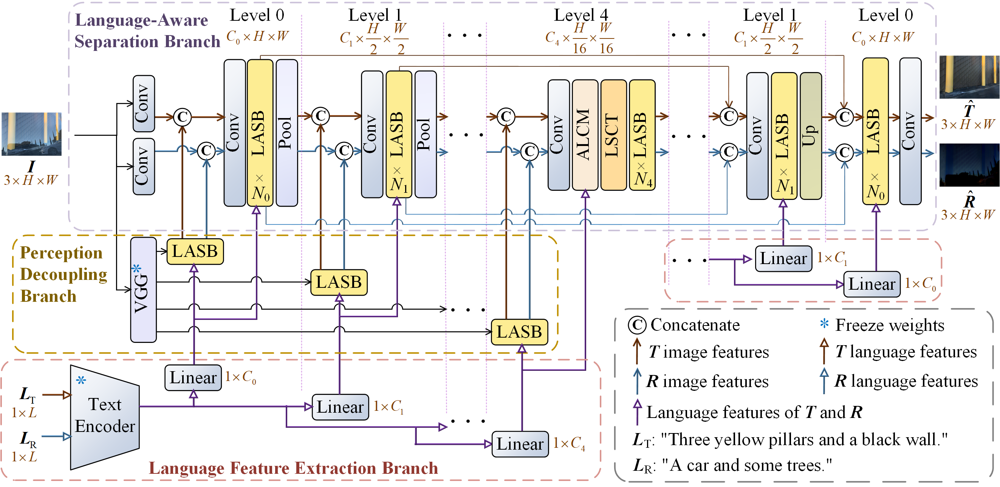

# ALANet

## Adaptive Language-Aware Image Reflection Removal Network (IJCAI'2025🔥)

> **Paper:** [Link to Paper](https://arxiv.org/abs/xxxx.xxxxx)  
> **Supplementary Material:** [PDF](https://arxiv.org/src/xxxx.xxxxxv1/anc/supplementary.pdf)

>**Abstract:** Existing image reflection removal methods struggle to handle complex reflections. Accurate language descriptions can help the model understand the image content to remove complex reflections. However, due to blurred and distorted interferences in reflected images,  machine-generated language descriptions of the image content are often inaccurate, which harms the performance of language-guided reflection removal.  To address this, we propose the Adaptive Language-Aware Network (ALANet) to remove reflections even with inaccurate language inputs. Specifically, ALANet integrates both filtering and optimization strategies. The filtering strategy reduces the negative effects of language while preserving its benefits, whereas the optimization strategy enhances the alignment between language and visual features. ALANet also utilizes language cues to decouple specific layer content from feature maps, improving its ability to handle complex reflections. To evaluate the model's performance under complex reflections and varying levels of language accuracy, we introduce the Complex Reflection and Language Accuracy Variance (CRLAV) dataset. Experimental results demonstrate that ALANet surpasses state-of-the-art methods for image reflection removal.

## 📌 Overview
<p align="center">
  
</p>

# ⚙️Important Requirements
python = 3.7  

pytorch = 1.9  

opencv-python = 4.9  

numpy = 1.21

scikit-image = 0.19

pillow = 9.5

# 🤖Pretrained Model
Download the pretrained models from the links below and place the files into the specified directories.

- **Model_ALANet:** [Download Link](https://pan.baidu.com/s/1vBKOIhkyA6IQoqRhemoMnA?pwd=1314)  
- **VGG19 Backbone:** [Download Link](https://pan.baidu.com/s/12YrcZZAL5JVAimX1Pco6tQ?pwd=1314)  
- **CLIP ViT-B/32:** [Download Link](https://pan.baidu.com/s/15mIWFp_ebE5vAWx8BHhKZg?pwd=1314)

---

**Your project tree should look like:**
```
project_root/
├─ checkpoints/
│  └─ ALANet/
│     └─ model_latest.pt   # (example filename)
├─ models/
│  └─ vgg19-dcbb9e9d.pth
├─ CLIP/
│  └─ ViT-B-32.pt
├─ app_gradio.py
├─ train.py
├─ test.py
└─ ...
```

# 📂 Dataset
We also release the **CRLAV dataset** used in our paper:

- **CRLAV Dataset:** [Download Link](https://pan.baidu.com/s/1Mv_TORQk9Ig2ifhQNZMTVQ?pwd=1314)

# 🚀Getting Started

## Train
Run the following command to train the model:

```bash
python train.py
```

## Test
Run the following command to test the model:

```bash
python test.py
```

## 📷Visualization Demo
We provide a **user-friendly UI** based on [Gradio](https://gradio.app/).  
Run the following command to launch an interactive web interface for testing and visualization:  

```bash
python app_gradio.py
```

This will start a local server and open a browser window where users can easily upload images, run reflection removal, and visualize the results in real time.


# 📬Contact
If you have any questions, please contact fangsiyanfsy@163.com
